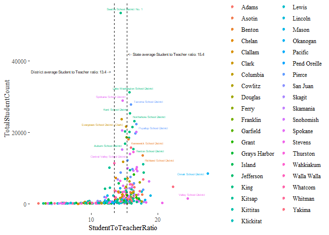

Deliverable 3
================

Packages

``` r
rm(list = ls())
library(tidyverse)
```

    ## -- Attaching packages --------------------------------------- tidyverse 1.3.2 --
    ## v ggplot2 3.3.6      v purrr   0.3.4 
    ## v tibble  3.1.6      v dplyr   1.0.10
    ## v tidyr   1.2.1      v stringr 1.4.0 
    ## v readr   2.1.3      v forcats 0.5.2 
    ## -- Conflicts ------------------------------------------ tidyverse_conflicts() --
    ## x dplyr::filter() masks stats::filter()
    ## x dplyr::lag()    masks stats::lag()

``` r
library(ggplot2)
library(scales)
```

    ## 
    ## Attaching package: 'scales'
    ## 
    ## The following object is masked from 'package:purrr':
    ## 
    ##     discard
    ## 
    ## The following object is masked from 'package:readr':
    ## 
    ##     col_factor

``` r
library(ggthemes)
library(rio)
#library(pivottabler)
library(ggrepel)
library(usmap)
```

Setting up the data

``` r
df <- read.csv("https://github.com/Charting-Chumps/Data/raw/main/2020_2021_Washington_Public_Schools_Student_Teacher_Ratio.csv")
names(df)[1] <- 'County'
df2 <- read.csv("https://github.com/Charting-Chumps/Data/raw/main/geographic_codes.csv")
```

Data Analysis/Cleaning

``` r
STRmean = mean(df$StudentToTeacherRatio)
WeightedSTRmean = sum(df$TotalStudentCount) / sum(df$TotalTeacherCount)
```

Chart 1

``` r
base = ggplot(df,aes(x = StudentToTeacherRatio,y = TotalStudentCount,
                       color = County,
                       label = DistrictName))
plot1 = base + 
  geom_point() + 
  theme_tufte() +
  geom_text_repel(size = 1.5 , max.overlaps = 10)
plot2 = plot1 +
  geom_vline(xintercept = STRmean,
                           size=0.3,
                           color = "black", 
                           linetype = "dashed") + 
  annotate(geom = 'text', 
                 label = "District average Student to Teacher ratio: 13.4 ->",
                 size = 2.1,
                 y = 37000,
                 x=7,
                 angle=0) + 
  geom_vline(xintercept = WeightedSTRmean,
                           size=0.3,
                           color = "black", 
                           linetype = "dashed") + 
  annotate(geom = 'text', 
                 label = "<- State average Student to Teacher ratio: 15.4",
                 size = 2.1,
                 y = 42000,
                 x=21.2,
                 angle=0)
plot2
```

    ## Warning: ggrepel: 295 unlabeled data points (too many overlaps). Consider
    ## increasing max.overlaps

<!-- -->

``` r
basepointbar = ggplot(df,aes(x = reorder(County,-StudentToTeacherRatio), #Reordered so that counties with a low student:teacher ratio show up first, and ones with higher student:teacher ratios show up later. We can change this to a different method if we want. I tried reordering by the number of students but that clumped up all the big dots in the same area, so it was kinda ugly
                     y = StudentToTeacherRatio,
                     color = County, #We do not really need this but it make it look nicer.
                     size = TotalStudentCount)) #The size of each dot is proportional to the number of students in that district. R scales this nicely so that some bubbles are not massive and others way too small.
pointbar1 = basepointbar + 
  geom_point() +
  coord_flip() + #Flips the coordinates, which makes the counties readable
  theme_tufte() + #This is a theme that make the chart look better. Not tied to this if someone has something they like more
  labs(title="Districts in rural counties have lower student:teacher ratios than urban districts",
       x ="County",
       y = "Student:Teacher ratio",
       caption = "Source: Washington State Department of Education") +
  theme(legend.position = "bottom", plot.caption = element_text(hjust = 0, size = 8), #these theme parameters are the same as what we had in assignment 2. Can change these if we want.
        plot.title = element_text(hjust = 0.5, size = 12),
        axis.title = element_text(size = 10)) +
  guides(color = "none") #this gets rid of the legend for each county, super ugly
pointbar1
```

<!-- -->

Student/Teacher ratio on top of WA map

``` r
names(df2)[1] <- 'County'
names(df2)[3] <- "fips"

waMapSchool <- left_join(df, df2, by = "County")

#Find average district Student to Teacher ratio and group in each County
waMapSchool2 <- waMapSchool %>%
  group_by(County) %>%
#find average Student to teacher ratio   
  mutate(mean(StudentToTeacherRatio))

#Map the ratio on a WA map and show county boundaries 
plot_usmap(data = waMapSchool2, values = "mean(StudentToTeacherRatio)", include = "WA") +
#low = low number of students per teacher & high = high number of students per teacher 
  scale_fill_continuous(low = "green", high = "red", name = "# of students per teacher") + 
  labs(title = "Average District Student-to-Teacher Ratio across different WA Counties") +
  theme(legend.position = "right")
```

    ## Warning: Ignoring unknown parameters: linewidth

<!-- -->
